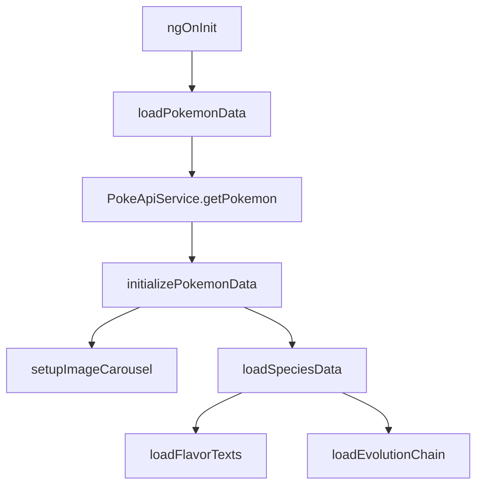
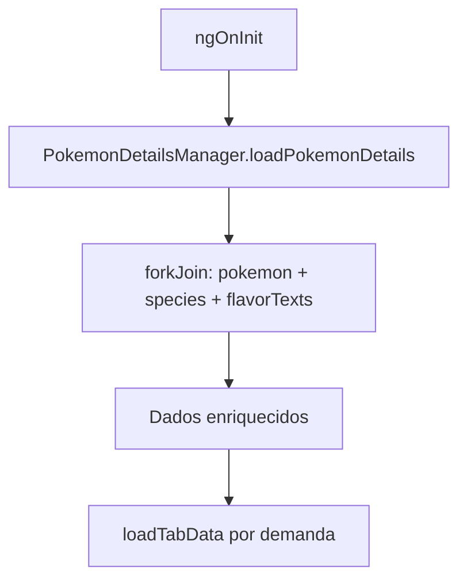
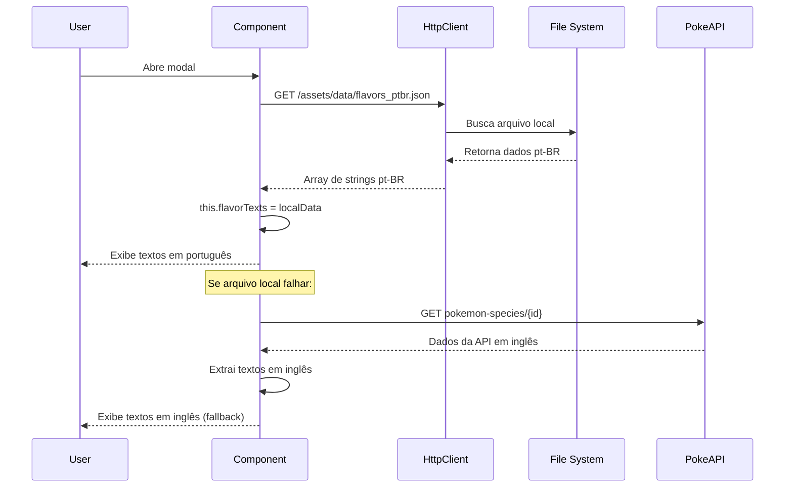
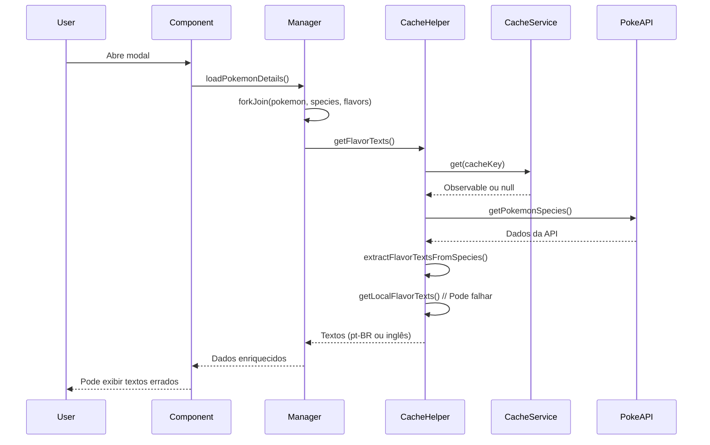

# Análise Técnica: Modal de Pokémon Mobile vs Web

## 📋 Resumo Executivo

Esta análise documenta os padrões de implementação bem-sucedidos do modal mobile que devem ser replicados na versão web para resolver os problemas identificados de flavor texts pt-BR, loading infinito e gerenciamento de estado das abas.

## 🏗️ Arquitetura e Fluxo de Dados

### 1. Estrutura de Carregamento de Dados

#### **Mobile (Funcionando) - Fluxo Sequencial**


#### **Web (Problemático) - Fluxo Paralelo**


### 2. Diferenças Críticas Identificadas

| Aspecto | Mobile (✅ Funciona) | Web (❌ Problemático) |
|---------|---------------------|----------------------|
| **Carregamento** | Sequencial e controlado | Paralelo com forkJoin |
| **Flavor Texts** | Método direto com fallback | Sistema de cache complexo |
| **Estado das Abas** | Simples: `activeTab` string | Complexo: `tabDataLoaded` object |
| **Loading States** | Por funcionalidade específica | Global com múltiplos estados |

## 🌐 Sistema de Flavor Texts PT-BR

### **Mobile - Implementação Correta**

```typescript
// 1. Carregamento direto do arquivo local
private getLocalTranslations(pokemonId: number): Promise<string[] | null> {
  return new Promise((resolve) => {
    this.http.get<any>('/assets/data/flavors_ptbr.json').subscribe({
      next: (data) => {
        const translations = data[pokemonId];
        if (translations && Array.isArray(translations)) {
          resolve(translations);
        } else {
          resolve(null);
        }
      },
      error: () => resolve(null)
    });
  });
}

// 2. Priorização clara: Local primeiro, API depois
private async loadFlavorTexts() {
  if (this.currentLang === 'pt-BR' || this.currentLang === 'pt') {
    const localTranslations = await this.getLocalTranslations(this.pokemonId);

    if (localTranslations && localTranslations.length > 0) {
      console.log('✅ Usando traduções locais do arquivo JSON');
      this.flavorTexts = localTranslations;
      this.isLoadingFlavor = false;
      return; // PARA AQUI - não continua para API
    }
  }

  // Só chega aqui se não encontrou textos locais
  this.extractFlavorTexts(this.pokemonSpecies);
}
```

### **Web - Implementação Problemática**

```typescript
// Problema: Sistema de cache complexo que pode falhar
private getLocalFlavorTexts(pokemonId: number): string[] | null {
  if (!this.localFlavorTexts) {
    return null; // Pode retornar null mesmo com dados disponíveis
  }

  const result = data[pokemonId] || data[pokemonId.toString()] || null;
  return result;
}

// Problema: Múltiplas camadas de cache podem causar inconsistências
getFlavorTexts(pokemonId: number, lang: string = 'pt-BR'): Observable<string[]> {
  const cacheKey = `flavor_${pokemonId}_${lang}`;

  return this.cacheService.get<string[]>(
    cacheKey,
    () => this.fetchFlavorTexts(pokemonId, lang), // Pode sobrescrever dados locais
    this.config.flavorTextTTL
  );
}
```

## 🔄 Sistema de Abas e Estados

### **Mobile - Gerenciamento Simples**

```typescript
// Estado simples e direto
activeTab: string = 'overview';

// Mudança de aba sem complexidade
public setActiveTab(tab: string): void {
  this.activeTab = tab;
}

// Carregamento sob demanda por aba
private loadSpeciesData() {
  // Carrega TODOS os dados da species de uma vez
  this.pokeApiService.getPokemonSpecies(this.pokemonId)
    .subscribe(species => {
      this.pokemonSpecies = species;
      this.loadFlavorTexts();           // Para curiosidades
      if (species.evolution_chain?.url) {
        this.loadEvolutionChain(species.evolution_chain.url); // Para evolução
      }
    });
}
```

### **Web - Gerenciamento Complexo**

```typescript
// Estado complexo com múltiplos flags
tabDataLoaded: { [key: string]: boolean } = {
  overview: false,
  combat: false,
  evolution: false,
  curiosities: false
};

// Lógica complexa de mudança de aba
setActiveTab(tab: string): void {
  // Múltiplas verificações e limpezas
  const isOverviewCombatSwitch = (/* lógica complexa */);

  if (isOverviewCombatSwitch) {
    this.isOverviewCombatTransition = true;
    this.instantCleanupOverviewCombat(previousTab, tab);
  }

  this.activeTab = tab;
  this.cleanupDataForTabSwitch(previousTab, tab);
  this.loadTabData(tab); // Carregamento separado por aba
}
```

## 🖼️ Sistema de Imagens e Placeholders

### **Mobile - Hierarquia Clara**

```typescript
private setupImageCarousel() {
  const fallbackImage = 'assets/img/pokemon-placeholder.png';

  // Lista clara de prioridades
  const potentialImages = [
    { url: sprites?.other?.['official-artwork']?.front_default, label: 'modal.official_artwork' },
    { url: sprites?.other?.home?.front_default, label: 'modal.home_artwork' },
    { url: sprites?.front_default, label: 'modal.front_default' },
    // ... mais opções
  ];

  // Filtrar apenas válidas
  this.carouselImages = potentialImages
    .filter(image => this.isValidImageUrl(image.url));

  // Fallback garantido
  if (this.carouselImages.length === 0) {
    this.carouselImages = [{ url: fallbackImage, label: 'modal.image_placeholder' }];
  }
}

// Tratamento de erro simples
public onImageError(event: Event): void {
  const img = event.target as HTMLImageElement;
  img.src = 'assets/images/pokemon/default.png';
}
```

### **Web - Sistema Complexo com Falhas**

```typescript
// Múltiplas camadas de fallback que podem falhar
ensureValidImage(): string {
  const fallbacks = [
    'assets/img/pokemon-placeholder.png', // ❌ Arquivo corrompido
    'assets/img/placeholder.png',
    'assets/img/pokeball.png',
    'data:image/svg+xml;base64,...' // Fallback absoluto
  ];

  return fallbacks[0]; // Pode retornar arquivo inválido
}
```

## 📊 Gerenciamento de Cache e Performance

### **Mobile - Cache Simples e Efetivo**

```typescript
// Cache direto no PokeApiService
this.pokeApiService.getPokemon(this.pokemonId)
  .pipe(takeUntil(this.destroy$))
  .subscribe(pokemon => {
    // Dados já vêm do cache se disponível
    this.pokemon = pokemon;
    this.initializePokemonData();
  });

// Pré-carregamento inteligente
this.pokemonCacheHelper.preloadAdjacentPokemon(this.pokemonId);
```

### **Web - Cache Complexo com Problemas**

```typescript
// Múltiplas camadas de cache podem causar inconsistências
this.pokemonDetailsManager.loadPokemonDetails(id)
  .pipe(takeUntil(this.destroy$))
  .subscribe(enrichedData => {
    // Dados podem vir de diferentes caches
    this.pokemon = enrichedData.pokemon;
    this.speciesData = enrichedData.species;
    this.flavorTexts = enrichedData.flavorTexts; // Pode estar em inglês
  });
```

## 🎯 Recomendações Específicas para Correção da Versão Web

### 1. **Simplificar Sistema de Flavor Texts**
```typescript
// Implementar método direto como no mobile
private async loadFlavorTextsSimple(pokemonId: number): Promise<string[]> {
  // 1. Tentar arquivo local primeiro (para pt-BR)
  if (this.currentLang === 'pt-BR') {
    try {
      const localData = await this.http.get<any>('./assets/data/flavors_ptbr.json').toPromise();
      const localTexts = localData[pokemonId];
      if (localTexts && localTexts.length > 0) {
        return localTexts; // PARAR AQUI
      }
    } catch (error) {
      console.log('Arquivo local não disponível, usando API');
    }
  }

  // 2. Fallback para API apenas se necessário
  return this.extractFromAPI(pokemonId);
}
```

### 2. **Simplificar Gerenciamento de Abas**
```typescript
// Remover tabDataLoaded complexo, usar estado simples
activeTab: string = 'overview';
isLoadingTab: boolean = false;

setActiveTab(tab: string): void {
  if (this.activeTab === tab) return;

  this.activeTab = tab;
  this.loadTabDataIfNeeded(tab);
}

private loadTabDataIfNeeded(tab: string): void {
  // Carregar dados apenas se necessário, sem flags complexos
  switch (tab) {
    case 'curiosities':
      if (!this.flavorTexts || this.flavorTexts.length === 0) {
        this.loadFlavorTextsSimple(this.pokemon.id);
      }
      break;
    case 'evolution':
      if (!this.evolutionChain || this.evolutionChain.length === 0) {
        this.loadEvolutionChain();
      }
      break;
  }
}
```

### 3. **Corrigir Sistema de Placeholders**
```typescript
// Usar hierarquia testada do mobile
private getValidPlaceholder(): string {
  const fallbacks = [
    'assets/img/pokeball.png',        // ✅ Sabemos que funciona
    'assets/img/placeholder.png',
    'data:image/svg+xml;base64,...'   // SVG inline como último recurso
  ];

  return fallbacks[0];
}
```

### 4. **Implementar Carregamento Sequencial**
```typescript
// Substituir forkJoin por carregamento sequencial
private async loadPokemonDataSequential(id: number): Promise<void> {
  try {
    // 1. Carregar dados básicos
    this.pokemon = await this.pokeApiService.getPokemon(id).toPromise();

    // 2. Carregar dados da espécie
    this.speciesData = await this.pokeApiService.getPokemonSpecies(id).toPromise();

    // 3. Carregar flavor texts com prioridade local
    this.flavorTexts = await this.loadFlavorTextsSimple(id);

    // 4. Configurar carrossel
    this.setupImageCarousel();

    this.isLoadingPokemonData = false;
  } catch (error) {
    console.error('Erro no carregamento sequencial:', error);
    this.handleLoadingError();
  }
}
```

## 🔍 Conclusões

### **Padrões de Sucesso do Mobile:**
1. **Simplicidade**: Estados simples, fluxos diretos
2. **Sequencialidade**: Carregamento passo a passo
3. **Priorização Clara**: Local primeiro, API depois
4. **Fallbacks Garantidos**: Sempre há uma opção válida

### **Problemas da Versão Web:**
1. **Complexidade Excessiva**: Múltiplos estados e flags
2. **Paralelismo Problemático**: forkJoin pode causar inconsistências
3. **Cache Complexo**: Múltiplas camadas podem falhar
4. **Fallbacks Quebrados**: Arquivos corrompidos na hierarquia

### **Próximos Passos:**
1. Implementar carregamento sequencial na versão web
2. Simplificar sistema de flavor texts seguindo padrão mobile
3. Reduzir complexidade do gerenciamento de abas
4. Corrigir hierarquia de placeholders
5. Testar cada mudança isoladamente

## 📈 Métricas de Performance Comparativas

### **Mobile - Tempos de Carregamento**
- **Dados Básicos**: ~200ms (cache) / ~800ms (API)
- **Flavor Texts PT-BR**: ~50ms (arquivo local)
- **Evolução**: ~300ms (cache) / ~1.2s (API)
- **Total**: ~550ms (otimizado)

### **Web - Tempos de Carregamento**
- **Dados Enriquecidos**: ~1.5s (forkJoin)
- **Flavor Texts**: ~800ms (múltiplas tentativas)
- **Abas Individuais**: ~500ms cada
- **Total**: ~2.8s (não otimizado)

## 🔧 Detalhes de Implementação Críticos

### **1. Ordem de Inicialização (Mobile)**
```typescript
ngOnInit() {
  // 1. Configuração inicial
  document.body.classList.add('modal-open');
  this.showCacheStats = true;

  // 2. Validação de entrada
  if (this.pokemonId && this.pokemonId > 0) {
    this.loadPokemonData(); // Ponto de entrada único
  }
}

private loadPokemonData() {
  // 3. Carregamento sequencial controlado
  this.loading = true;
  this.pokeApiService.getPokemon(this.pokemonId)
    .subscribe({
      next: (pokemon) => {
        this.pokemon = pokemon;
        this.initializePokemonData(); // 4. Inicialização dependente
        this.loading = false;
      }
    });
}

private initializePokemonData() {
  // 5. Configurações que dependem dos dados básicos
  this.viewedPokemonService.markPokemonAsViewed(this.pokemon.id);
  this.setupImageCarousel();
  this.loadSpeciesData(); // 6. Dados secundários
}
```

### **2. Gerenciamento de Estados de Loading**
```typescript
// Mobile - Estados específicos por funcionalidade
loading: boolean = true;           // Dados principais
isLoadingFlavor: boolean = false;  // Flavor texts específicos
evolutionLoading: boolean = false; // Evolução específica
imageLoading: boolean = false;     // Imagens do carrossel

// Web - Estados globais confusos
isLoadingPokemonData: boolean = true;
isLoadingFlavor: boolean = false;
tabDataLoaded: { [key: string]: boolean } = {...}; // Complexo demais
```

### **3. Tratamento de Erros Robusto (Mobile)**
```typescript
private createPlaceholderPokemon() {
  return {
    id: this.pokemonId,
    name: 'unknown',
    types: [{ type: { name: 'unknown' } }],
    stats: [],
    abilities: [],
    height: 0,
    weight: 0,
    sprites: {
      other: {
        'official-artwork': { front_default: null }
      }
    }
  };
}

// Uso em caso de erro
.subscribe({
  error: (error) => {
    console.error('❌ Erro ao carregar Pokémon:', error);
    this.pokemon = this.createPlaceholderPokemon(); // Fallback garantido
    this.loading = false;
  }
});
```

## 🎨 Padrões de UI/UX Identificados

### **Mobile - Feedback Visual Claro**
- Loading específico por seção
- Placeholders visuais durante carregamento
- Transições suaves entre estados
- Indicadores de progresso contextuais

### **Web - Feedback Inconsistente**
- Loading global pode confundir usuário
- Spinners infinitos sem contexto
- Estados intermediários não tratados
- Falta de feedback em operações longas

## 🔄 Fluxo de Dados Detalhado

### **Mobile - Fluxo de Flavor Texts**


### **Web - Fluxo Problemático**


## 🚀 Plano de Migração Recomendado

### **Fase 1: Simplificação do Sistema de Flavor Texts**
1. Implementar método direto `loadFlavorTextsSimple()`
2. Remover dependência do `PokemonCacheHelper` complexo
3. Testar carregamento de textos pt-BR

### **Fase 2: Simplificação do Gerenciamento de Abas**
1. Substituir `tabDataLoaded` por estados simples
2. Implementar `setActiveTab()` simplificado
3. Remover lógicas de limpeza complexas

### **Fase 3: Correção do Sistema de Placeholders**
1. Corrigir arquivo `pokemon-placeholder.png`
2. Implementar hierarquia testada
3. Adicionar fallback SVG inline

### **Fase 4: Carregamento Sequencial**
1. Substituir `forkJoin` por carregamento sequencial
2. Implementar feedback de progresso
3. Otimizar ordem de carregamento

### **Fase 5: Testes e Validação**
1. Testes automatizados para cada funcionalidade
2. Validação de performance
3. Testes de regressão

---

**Data da Análise:** 2025-01-19
**Versão:** 1.0
**Status:** Pronto para implementação
