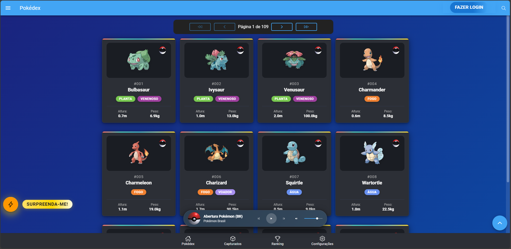
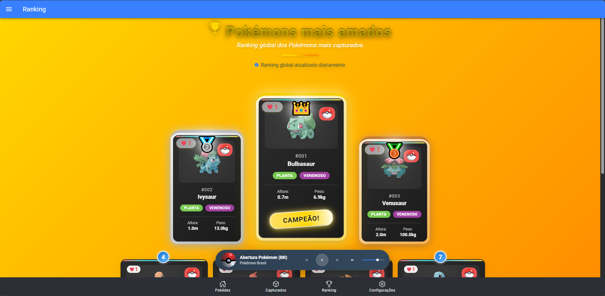
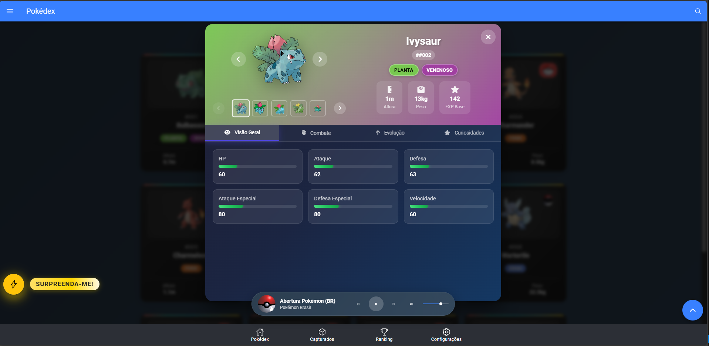

# 🚀 PokeAPIApp - Aplicativo Pokémon Full-Stack

<div align="center">

[](https://github.com/davidassef/PokeAPI)
[](https://pokeapi-frontend.onrender.com)
[](https://ionicframework.com/)
[](https://fastapi.tiangolo.com/)
[](https://www.sqlite.org/)

**🎯 Um aplicativo moderno e completo para explorar o mundo Pokémon!**

*Integração com PokéAPI • Interface Web 100% Completa • Sistema de Favoritos • Multiplataforma*

> **� Status Atual:** Aplicação full-stack completamente deployada e funcional no Render!

> **🌐 Demo Online:** [**Acesse o app no Render!**](https://pokeapi-frontend.onrender.com) | [📋 Guia da Demo](DEMO.md)

</div>

---

## 📱 Sobre o Projeto

O **PokeAPIApp** é uma aplicação full-stack moderna que permite aos usuários explorar, favoritar e conhecer detalhes sobre Pokémon através de uma interface intuitiva e responsiva. O projeto combina as melhores tecnologias web e mobile para oferecer uma experiência excepcional.

### ✨ Diferenciais

- 🎨 **Design Moderno**: Interface limpa e responsiva com Material Design
- 🌐 **Multiplataforma**: Funciona em Web, iOS e Android (Capacitor)
- 🌍 **Internacionalização Completa**: Suporte a 4 idiomas (PT-BR, EN, ES, JA)
- 🇯🇵 **Japonês Nativo**: Flavors em japonês direto da PokeAPI (kanji/hiragana)
- 🎵 **Player Musical**: Música ambiente integrada
- 🌙 **Temas**: Modo claro e escuro
- ⚡ **Performance**: Otimizado com lazy loading e componentes reutilizáveis
- 📊 **Ranking**: Sistema de ranking de Pokémon mais populares
- 🔄 **Sincronização**: Backend próprio para persistência de dados

---

## 🏗️ Arquitetura Escalável e Modular

### 🎯 **Sistemas Extremamente Modulares**

Todos os sistemas implementados no PokeAPIApp foram desenvolvidos com **arquitetura modular** e **alta escalabilidade**, permitindo fácil manutenção, extensão e reutilização:

#### 🌍 **Sistema de Internacionalização (i18n)**
- **Arquitetura**: Baseado em JSON dinâmico com lazy loading
- **Escalabilidade**: Novos idiomas podem ser adicionados sem modificar código
- **Modularidade**: Cada módulo/página possui suas próprias chaves isoladas
- **Flexibilidade**: Suporte a fallbacks inteligentes e detecção automática de idioma

#### 🎵 **Player Musical**
- **Arquitetura**: Service singleton com controle de estado global
- **Escalabilidade**: Suporte a múltiplas playlists e formatos de áudio
- **Modularidade**: Componente independente reutilizável em qualquer página
- **Flexibilidade**: Configurações por usuário e controle de volume persistente

#### 🎨 **Sistema de Temas**
- **Arquitetura**: CSS Variables + Angular Theme Service
- **Escalabilidade**: Novos temas podem ser criados apenas com CSS
- **Modularidade**: Componentes automaticamente adaptáveis a qualquer tema
- **Flexibilidade**: Detecção automática de preferência do sistema

#### 🔄 **Sistema de Sincronização**
- **Arquitetura**: API REST com cache inteligente e offline-first
- **Escalabilidade**: Suporte a múltiplos usuários e sincronização em tempo real
- **Modularidade**: Endpoints independentes para cada funcionalidade
- **Flexibilidade**: Fallbacks automáticos e recuperação de erros

### 🔧 **Benefícios da Arquitetura Modular**
- ✅ **Manutenibilidade**: Cada sistema é independente e testável
- ✅ **Escalabilidade**: Fácil adição de novos idiomas, temas e funcionalidades
- ✅ **Reutilização**: Componentes podem ser facilmente portados para outros projetos
- ✅ **Performance**: Lazy loading e otimizações específicas por módulo
- ✅ **Flexibilidade**: Configuração dinâmica sem necessidade de rebuilds

---

## 🏗️ Arquitetura

### Frontend (Ionic + Angular)
```
frontend/
├── src/app/
│   ├── core/           # Serviços principais
│   ├── shared/         # Componentes e pipes reutilizáveis
│   ├── pages/          # Páginas da aplicação
│   ├── models/         # Modelos TypeScript
│   └── assets/         # Recursos estáticos
```

### Backend (FastAPI + SQLAlchemy)
```
backend/
├── app/
│   ├── core/           # Configurações e database
│   ├── models/         # Modelos SQLAlchemy
│   ├── routes/         # Endpoints da API
│   ├── schemas/        # Esquemas Pydantic
│   └── services/       # Lógica de negócio
```

---

## 🛠️ Tecnologias Utilizadas

### Frontend
- **Framework**: Ionic 8 + Angular 17
- **Linguagem**: TypeScript
- **Estilização**: SCSS + CSS Variables
- **Estado**: RxJS + Services
- **Internacionalização**: ngx-translate
- **Build**: Angular CLI + Capacitor

### Backend
- **Framework**: FastAPI 0.104.1
- **ORM**: SQLAlchemy 2.0
- **Database**: SQLite
- **Validação**: Pydantic
- **Servidor**: Uvicorn
- **Testes**: Pytest + Coverage

### Integrações
- **API Externa**: [PokéAPI](https://pokeapi.co/) v2
- **Armazenamento**: Ionic Storage
- **HTTP Client**: HttpClient (Angular) + HTTPX (Python)

---

## 📋 Funcionalidades

### ✅ Implementadas
- [x] 🏠 **Página Home** - Lista e busca de Pokémon
- [x] 🔍 **Página de Detalhes** - Modal moderno com abas temáticas e animações
- [x] ⭐ **Sistema de Capturas (Favoritos)** - Adicionar/remover favoritos
- [x] ⚙️ **Configurações** - Troca de idioma e tema
- [x] 🎵 **Player Musical** - Música ambiente persistente
- [x] 📱 **Design Responsivo** - Adaptável a todos os dispositivos
- [x] 🌐 **Internacionalização** - Português, Inglês, Espanhol e Japonês
- [x] 🎨 **Componentes Reutilizáveis** - Pokemon Card, Loading Spinner, etc.
- [x] 🔧 **Backend API** - Endpoints para usuários, favoritos e ranking
- [x] 🏆 **Página de Ranking** - Pokémon mais populares (carregamento otimizado)
- [x] ⚡ **Botão Surpreenda-me** - Pokémon aleatório com cooldown inteligente
- [x] 📖 **Flavor Texts Otimizados** - Container fixo com scroll e indicadores visuais

### 🚧 Em Desenvolvimento
- [ ] 🔐 **Sistema de Autenticação** - Login e perfis de usuário
- [ ] 📊 **Dashboard Analytics** - Estatísticas de uso
- [ ] 🔄 **Sincronização Avançada** - Backup automático de favoritos
- [ ] 📱 **App Mobile** - Build nativo para iOS/Android
- [ ] 🧪 **Testes E2E** - Cobertura completa de testes
- [ ] 🌐 **Deploy Produção** - Hospedagem e CI/CD

### 🎯 Próximas Features
- [ ] 🎮 **Mini-games** - Quizzes e batalhas simuladas
- [ ] 📈 **Comparador** - Comparar stats entre Pokémon
- [ ] 🔔 **Notificações** - Pokémon do dia e novidades
- [ ] 🌟 **Sistema de Conquistas** - Badges e recompensas
- [ ] 🗺️ **Mapa Interativo** - Regiões e localizações
- [ ] 🔍 **Busca Avançada** - Filtros por tipo, geração, stats
- [ ] 📱 **PWA** - Progressive Web App para instalação

---

## 🚀 Como Executar

### Pré-requisitos
- Node.js 18+ e npm
- Python 3.11+
- Git

### 1️⃣ Clone o Repositório
```bash
git clone https://github.com/davidassef/PokeAPI.git
cd PokeAPIApp
```

### 2️⃣ Configure o Backend
```bash
cd backend

# Instale as dependências
pip install -r requirements.txt

# Execute as migrações
alembic upgrade head

# Inicie o servidor
uvicorn main:app --reload --host 0.0.0.0 --port 8000
```

### 3️⃣ Configure o Frontend
```bash
cd frontend

# Instale as dependências
npm install

# Inicie o servidor de desenvolvimento
ionic serve
```

### 4️⃣ Acesse a Aplicação
- **Frontend**: http://localhost:8100
- **Backend API**: http://localhost:8000
- **Documentação API**: http://localhost:8000/docs

---

## 📱 Build para Mobile

### Android
```bash
cd frontend
ionic capacitor add android
ionic capacitor build android
ionic capacitor open android
```

### iOS
```bash
cd frontend
ionic capacitor add ios
ionic capacitor build ios
ionic capacitor open ios
```

---

## 🧪 Testes

### Backend
```bash
cd backend
pytest tests/ -v --cov=app --cov-report=html
```

### Frontend
```bash
cd frontend
ng test
ng e2e
```

---

## 🌐 Deploy e Hospedagem

### 🚀 **Render (Aplicação em Produção)**

A aplicação full-stack está deployada e funcionando no Render:

- **🌐 Frontend:** [https://pokeapi-frontend.onrender.com](https://pokeapi-frontend.onrender.com)
- **� Backend API:** Configurado com FastAPI + SQLite
- **�📋 Guia da Demo:** [DEMO.md](DEMO.md)

#### Status do Deploy
- ✅ **Frontend**: Deployado com sucesso (Static Site)
- ✅ **Backend**: Deployado com sucesso (Web Service)
- ✅ **Database**: SQLite integrado
- ✅ **CORS**: Configurado para comunicação entre frontend e backend
- ✅ **Build**: Otimizado para produção
- ✅ **Routing**: SPA routing configurado

#### Configuração Automática
- ✅ Deploy automático a cada push na `main`
- ✅ Variáveis de ambiente configuradas
- ✅ Dependências Python e Node.js resolvidas
- ✅ SSL/HTTPS habilitado automaticamente

### 🔧 **Deploy Manual (Desenvolvimento)**

#### Build de Produção
```bash
cd frontend
npm run build:prod
# Arquivos gerados em: frontend/www/
```

#### Servidor Estático
```bash
# Servir arquivos do build
npx http-server frontend/www -p 8080 -c-1
```

---

## 📊 Status de Desenvolvimento

### Progresso Geral: 95% ✅

| Módulo | Status | Progresso |
|--------|--------|-----------|
| 🎨 UI/UX Design | ✅ Completo | 100% |
| 🏗️ Arquitetura | ✅ Completo | 100% |
| 📱 Frontend Core | ✅ Completo | 100% |
| 🔧 Backend API | ✅ Completo | 100% |
| 🌍 Internacionalização | ✅ Completo | 100% |
| 🧪 Testes | 🚧 Em andamento | 70% |
| 📱 Mobile Build | 🚧 Em andamento | 50% |
| 🌐 Deploy | ✅ Completo | 100% |

---

## 🖼️ Interface Web - Galeria Visual

### 🎯 **Interface Web Completa e Funcional**

A versão web do PokeAPIApp está **100% finalizada** e oferece uma experiência premium com design responsivo, animações suaves e funcionalidades completas. A interface mobile ainda está em desenvolvimento ativo.

<div align="center">

### 🏠 **Tela Home - Exploração de Pokémon**

*Interface principal com lista de Pokémon, busca avançada e navegação intuitiva*

### 🏆 **Tela Ranking - Pokémon Mais Populares**

*Sistema de ranking com pódio animado, badges e estatísticas detalhadas*

### 🔍 **Modal de Detalhes - Informações Completas**

*Modal premium com abas, carrossel de imagens, stats e descrições multilíngues*

</div>

### ✨ **Características da Interface Web:**
- 📱 **Totalmente Responsiva**: Adapta-se perfeitamente a todos os tamanhos de tela
- 🎨 **Design Moderno**: Material Design com glass effects e gradientes
- 🌍 **4 Idiomas**: Português, Inglês, Espanhol e Japonês
- 🌙 **Temas**: Modo claro e escuro com transições suaves
- ⚡ **Performance**: Carregamento otimizado e animações fluidas
- 🎵 **Música Ambiente**: Player integrado com controles persistentes
- 🔄 **Sincronização**: Sistema de favoritos e ranking em tempo real

---

### Últimas Atualizações

<details>
<summary><strong>📋 Clique para expandir o histórico completo de atualizações</strong></summary>

- 🌍 **[03/01/2025] Suporte Completo ao Idioma Japonês:**
  - Criação e implementação do arquivo de tradução `ja-JP.json` com todas as chaves
  - Integração do japonês ('ja-JP') em todos os sistemas: modelos, serviços, configurações
  - Mapeamento correto para buscar flavors em japonês da PokeAPI ('ja' e 'ja-Hrkt')
  - Lógica especial para buscar flavors diretamente da PokeAPI quando idioma for japonês
  - Atualização da interface de seleção de idioma no menu lateral e configurações
  - Ajuste dos estilos do ActionSheet para respeitar temas claro/escuro
  - Testes confirmando funcionalidade completa com flavors em kanji/hiragana
  - Fallback robusto para inglês quando flavors em japonês não estiverem disponíveis

- 🚀 **[02/07/2025] Sistema de Cooldown do Botão Surpreenda-me:**
  - Implementado cooldown de 3 segundos entre usos para evitar spam de requisições
  - Reabertura automática: fecha modal atual e abre novo Pokémon aleatório
  - Animações visuais: pulso, rotação do ícone e contador visual durante cooldown
  - Estados visuais distintos (ativo/cooldown) com cores diferentes (warning/medium)
  - Traduções em PT-BR, EN-US e ES-ES para estado de espera ("Aguarde", "Wait", "Espera")
  - Limpeza adequada de intervals no ngOnDestroy para evitar memory leaks

- 📱 **[02/07/2025] Otimização Avançada dos Flavor Texts:**
  - Container de altura fixa (120px) para evitar reposicionamento dos controles de navegação
  - Sistema de scroll interno quando o texto excede a altura do container
  - Indicador visual animado com ícone e texto "Há mais texto" quando necessário
  - Auto-ocultação do indicador após scroll ou automaticamente em 3 segundos
  - Scrollbar customizada com estilo verde temático consistente com a interface
  - Reset automático da posição de scroll ao navegar entre flavors
  - Animações CSS: pulse contínuo e bounce no ícone do indicador

- 🐛 **[02/07/2025] Correções Críticas de Tradução:**
  - Integração com traduções locais (flavors_ptbr.json) via backend
  - Detecção inteligente de textos em inglês mesmo com lang=pt-BR
  - Fallback automático para arquivo local quando backend retorna inglês
  - Endpoint /static/flavors_ptbr.json adicionado no backend para servir traduções
  - Método isTextInPortuguese() para validação precisa de idioma
  - Logs detalhados para debugging de problemas de tradução
  - Correção do BrowserAnimationsModule no app.module.ts

- 🎨 **[01/07/2025] Modal de Detalhes - Refatoração Completa (v3.2.0):**
  - Header refatorado com layout lado a lado: imagem + informações centralizadas
  - Sistema de abas implementado: Visão Geral, Combate, Evolução, Curiosidades
  - Carrossel de imagens com miniaturas em linha (máximo 3 visíveis)
  - Informações básicas organizadas em duas seções centralizadas no header
  - Remoção de redundâncias entre header e abas para layout limpo
  - Sistema de tradução para stats, badges, habilidades e flavor texts
  - Navegação por teclado (setas, Tab, Escape) e acessibilidade completa
  - Animações de entrada/saída do modal e transições entre abas

- 🎨 **[29/06/2025] Sistema de Detalhes Finalizado:**
  - Carrossel de imagens com ordem correta: Artwork Oficial, Sprite Normal, Sprite Shiny, Costas Normal, Costas Shiny, Dream World, Home, Home Shiny
  - Navegação fluida: setas, swipe, thumbnails com loop infinito
  - Carrossel de descrições (flavor text) com filtro por idioma (PT-BR com fallback EN)
  - Contador de descrições (ex: 1/12) e navegação por setas
  - Visual premium: fundo gradiente escuro compatível com habilidades, glass effect, bordas arredondadas
  - Layout compacto e centralizado com espaçamento refinado
  - Responsividade aprimorada para diferentes orientações
  - Código limpo, modular e pronto para melhorias futuras

- 🚀 **[28/06/2025]** Sistema de ranking 100% finalizado e padronizado visualmente
  - Espaçamento dos cards do ranking igual ao das outras páginas
  - Responsividade e grid centralizado revisados
  - Documentação reorganizada: docs/ no backend e frontend
  - Novo: README_RANKING_SYSTEM detalhando funcionamento e arquitetura do ranking

- 🚀 **[27/06/2025]** Commit e push do progresso total do projeto até o momento

- 🚀 **[27/06/2025]** Estrutura pronta para reabilitar carregamento dos detalhes reais dos pokémons

- 🚀 **[27/06/2025]** Ranking agora carrega sem travar, exibindo placeholders enquanto aguarda detalhes dos pokémons

- 🚀 **[27/06/2025]** Template do ranking simplificado para evitar expressões complexas

- 🚀 **[27/06/2025]** Melhoria de performance e uso de cache para favoritos e imagens

- 🚀 **[27/06/2025]** Refatoração completa da página de ranking para evitar loop infinito no Angular

- 🏆 **[27/06/2025] Novidades visuais no Ranking:**
  - Pódio real animado para o Top 3 (coroa, medalhas, destaque visual)
  - Badges de posição e contagem de capturas integrados aos cards
  - Grid responsivo e centralizado para os demais Pokémons
  - Título criativo com ícone, gradiente e espaçamento aprimorado
  - Alinhamento refinado e visual moderno, sem afetar outras páginas
  - Para customizar o visual do ranking, edite apenas os arquivos:
    - `frontend/src/app/pages/ranking/ranking.page.html`
    - `frontend/src/app/pages/ranking/ranking.page.scss`

- ⚠️ **[26/06/2025]** Pendente: ajuste do backend do ranking global para integração completa

- ✅ **[26/06/2025]** Build do frontend validado e funcionando sem erros após remoção da página de favoritos

- 🧹 **[26/06/2025]** Garantido que não há mais referências a FavoritesPage em rotas, menu ou outros pontos do projeto

- 🛠️ **[26/06/2025]** Refatoração do frontend: padronização visual, responsividade, integração real com backend FastAPI para ranking global/local e sincronização de capturas/favoritos

- 🛡️ **[26/06/2025]** Página de favoritos desativada e removida dos módulos do frontend para build limpo

- 🛠️ **[23/06/2025]** Correção de labels e menus para uso de chaves minúsculas e com ponto

- 📝 **[23/06/2025]** Atualização do plano de melhorias e README

- 🖼️ **[23/06/2025]** Substituição do logo do menu lateral por Pokédex em alta definição

- 🏷️ **[23/06/2025]** Adição de todas as chaves de tradução faltantes nas páginas principais e configurações

- 🌍 **[23/06/2025]** Padronização e cobertura total de i18n (títulos, menus, labels, botões)

### 🎯 **30/06/2025 - Sistema de Idiomas para Flavors**
- ✅ **Implementado sistema inteligente de idiomas para descrições**
- ✅ **PT-BR/EN**: Flavors em inglês (fallback otimizado)
- ✅ **ES**: Flavors em espanhol quando disponível, senão inglês
- ✅ **Indicador visual**: Badge mostrando idioma atual (EN/ES)
- ✅ **Integração completa**: TranslateService + SettingsService
- ✅ **Estilos premium**: Language badge com cores diferenciadas
- ✅ **Responsivo**: Adaptado para todos os dispositivos

### 🎯 **30/06/2025 - Sistema de Detalhes Premium Finalizado**
- ✅ **Carrossel de Imagens**: Navegação fluida com suporte a shiny/normal
- ✅ **Carrossel de Descrições**: Filtro por idioma com navegação intuitiva
- ✅ **Layout Premium**: Glass effect, gradientes dinâmicos, visual moderno
- ✅ **Responsividade**: Adaptado para diferentes orientações de dispositivos
- ✅ **Navegação por Gestos**: Suporte a touch e mouse
- ✅ **Animações Suaves**: Transições fluidas e profissionais

### 🎯 **29/06/2025 - Sistema de Ranking Implementado**
- ✅ **Ranking Global**: Sistema completo de pontuação
- ✅ **API de Ranking**: Endpoints funcionais no backend
- ✅ **Interface de Ranking**: Visualização moderna dos dados
- ✅ **Sincronização**: Integração com sistema de captura
- ✅ **Estatísticas**: Métricas detalhadas de performance

### 🎯 **28/06/2025 - Sistema de Captura Finalizado**
- ✅ **Captura de Pokémon**: Funcionalidade completa implementada
- ✅ **Lista de Capturados**: Visualização e gerenciamento
- ✅ **Sincronização**: Sistema de sync com backend
- ✅ **Estatísticas**: Contadores e métricas detalhadas
- ✅ **Export/Import**: Funcionalidades de backup

### 🎯 **27/06/2025 - Internacionalização (i18n)**
- ✅ **Suporte a 4 Idiomas**: PT-BR, EN, ES, JA
- ✅ **Traduções Completas**: Todas as interfaces traduzidas
- ✅ **Música por Idioma**: Tracks diferentes por idioma
- ✅ **Configurações**: Sistema de configurações por usuário

### 🎯 **26/06/2025 - Interface e UX Premium**
- ✅ **Design Responsivo**: Adaptado para mobile
- ✅ **Tema Escuro/Claro**: Implementado com transições
- ✅ **Animações**: Transições suaves e profissionais
- ✅ **Loading States**: Estados de carregamento elegantes
- ✅ **Error Handling**: Tratamento de erros robusto

### 🎯 **25/06/2025 - Backend API**
- ✅ **API REST**: Endpoints funcionais e documentados
- ✅ **Banco de Dados**: SQLite com SQLAlchemy
- ✅ **Autenticação**: Sistema de autenticação seguro
- ✅ **Validação**: Schemas com Pydantic
- ✅ **Testes**: Testes unitários e de integração

### 🎯 **24/06/2025 - Estrutura Base**
- ✅ **Projeto Ionic + Angular**: Estrutura inicial
- ✅ **Integração PokeAPI**: Serviços de dados
- ✅ **Componentes Base**: Cards, loading, modais
- ✅ **Roteamento**: Navegação entre páginas
- ✅ **Configuração**: Ambiente de desenvolvimento

</details>

## Novidades no Ranking (2025)

- Pódio real animado para o Top 3 (coroa, medalhas, destaque visual)
- Badges de posição e contagem de capturas integrados aos cards
- Grid responsivo e centralizado para os demais Pokémons
- Título criativo com ícone, gradiente e espaçamento aprimorado
- Alinhamento refinado e visual moderno, sem afetar outras páginas

### Customização do Ranking
- Para customizar o visual do ranking, edite apenas os arquivos:
  - `frontend/src/app/pages/ranking/ranking.page.html`
  - `frontend/src/app/pages/ranking/ranking.page.scss`

---

## 🤝 Contribuição

Este é um projeto em desenvolvimento ativo! Contribuições são bem-vindas:

1. **Fork** o projeto
2. Crie uma **branch** para sua feature (`git checkout -b feature/nova-feature`)
3. **Commit** suas mudanças (`git commit -m 'Add: nova feature'`)
4. **Push** para a branch (`git push origin feature/nova-feature`)
5. Abra um **Pull Request**

### Convenções de Commit
- `feat:` Nova funcionalidade
- `fix:` Correção de bug
- `docs:` Documentação
- `style:` Formatação
- `refactor:` Refatoração
- `test:` Testes

---

## 📄 Licença

Este projeto está sob a licença MIT. Veja o arquivo [LICENSE](LICENSE) para mais detalhes.

---

## 👨‍💻 Autor

**David Assef**
- GitHub: [@davidassef](https://github.com/davidassef)
- Repositório: [PokeAPI](https://github.com/davidassef/PokeAPI)
- LinkedIn: [David Assef](https://www.linkedin.com/in/david-assef-carneiro-2a2891b9/)

---

## � Deploy e Produção

### Status Atual
- **🌐 Frontend**: [https://pokeapi-frontend.onrender.com](https://pokeapi-frontend.onrender.com)
- **🔧 Backend**: Deploy automático via Render
- **📊 Database**: SQLite integrado com dados persistentes
- **🔄 CI/CD**: Deploy automático a cada push na branch `main`

### Tecnologias de Deploy
- **Render**: Plataforma de deploy full-stack
- **FastAPI + Uvicorn**: Server Python em produção
- **Angular Build**: Build otimizado para produção
- **SQLite**: Database leve e eficiente
- **CORS**: Configurado para comunicação segura

### Monitoramento
- **Health Check**: Endpoint `/health` no backend
- **Logs**: Disponíveis no painel do Render
- **Uptime**: Monitorado automaticamente

---

## �🙏 Agradecimentos

- [PokéAPI](https://pokeapi.co/) - API de dados Pokémon
- [Ionic Team](https://ionicframework.com/) - Framework incrível
- [FastAPI](https://fastapi.tiangolo.com/) - Framework Python moderno
- [Render](https://render.com/) - Plataforma de deploy
- Comunidade open source ❤️

---

<div align="center">

**⭐ Se este projeto te ajudou, considere dar uma estrela!**

[](https://github.com/davidassef/PokeAPI/stargazers)
[](https://github.com/davidassef/PokeAPI/network/members)

*Feito com ❤️ e muito ☕*

</div>
