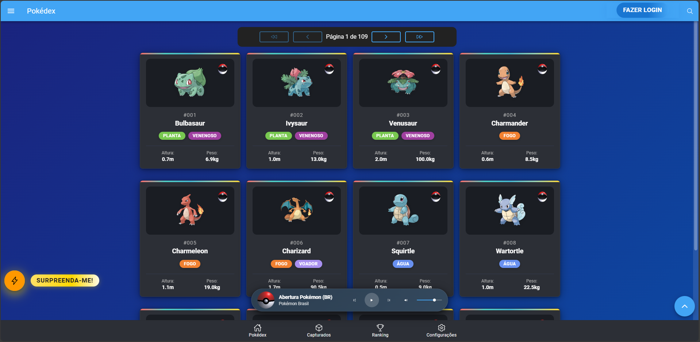
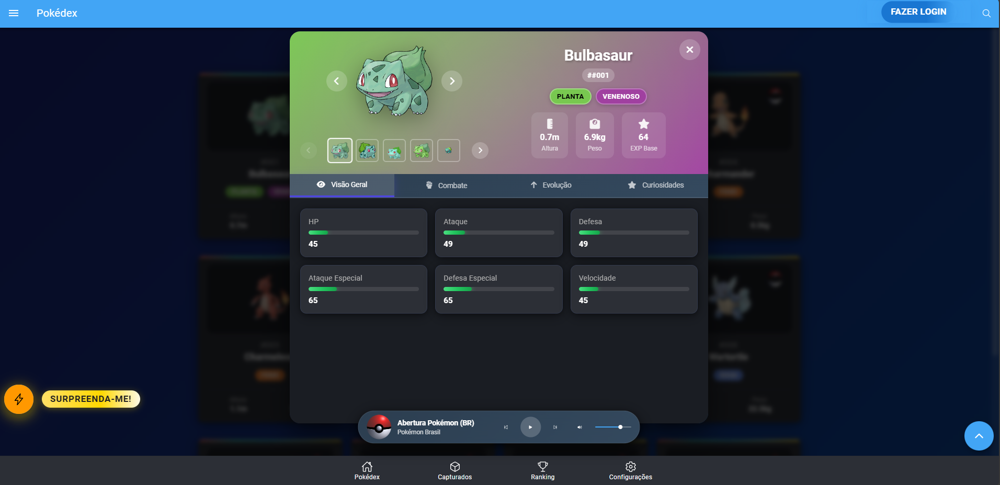
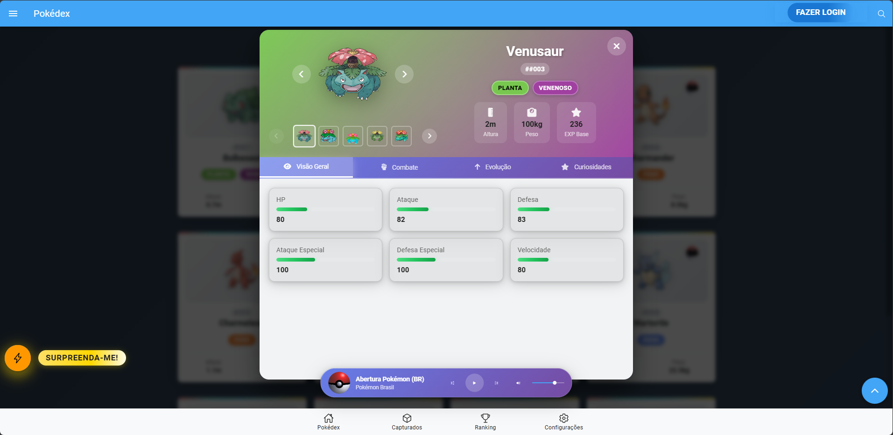

# 🚀 PokeAPIApp

🗓️ Última atualização: 11/07/2025 | ✨ **8 Melhorias Implementadas**

[](https://github.com/davidassef/PokeAPI)
[](https://ionicframework.com/)
[](https://fastapi.tiangolo.com/)
[](https://github.com/davidassef/PokeAPI)
[](https://www.w3.org/WAI/WCAG21/quickref/)
[](https://ionicframework.com/)

---

## � Melhorias Recentes (Julho 2025)

<details>
<summary><strong>✨ 8 Melhorias Implementadas - Clique para expandir</strong></summary>

### 🎨 **Interface e Acessibilidade**
- ✅ **Contraste Melhorado**: Cards de Pokémon com melhor visibilidade no tema claro
- ✅ **Modal Responsivo**: Abas do modal de detalhes agora respondem corretamente aos temas
- ✅ **Elementos Biográficos**: Melhor contraste para altura, peso, stats e habilidades
- ✅ **Acessibilidade WCAG AA**: Contraste mínimo 4.5:1 mantido em todos os componentes

### 🔧 **Sistema de Autenticação**
- ✅ **Backend Corrigido**: Resolvido erro 404 no endpoint `/api/v1/auth/register`
- ✅ **Interceptador Otimizado**: Rotas públicas (login/registro) não requerem mais token
- ✅ **Logs Melhorados**: Sistema de debug mais informativo para troubleshooting

### 🏗️ **Arquitetura e Qualidade**
- ✅ **Imports Organizados**: Estrutura modular corrigida no backend
- ✅ **Sistema RBAC**: Integração aprimorada entre autenticação e controle de acesso

</details>

---

## �🎯 Sobre o Projeto

**PokeAPIApp** é uma aplicação full-stack moderna para explorar o universo Pokémon, oferecendo uma experiência completa com Pokédex interativa, sistema de captura, ranking dinâmico e administração avançada.

### 🏗️ **Arquitetura**
- **Frontend**: Ionic + Angular com TypeScript
- **Backend**: FastAPI com Python
- **Banco de Dados**: SQLite com SQLAlchemy ORM
- **Autenticação**: JWT com sistema RBAC (Role-Based Access Control)
- **Internacionalização**: Suporte a múltiplos idiomas (PT, EN, ES)
- **Design**: Responsivo com temas claro/escuro

---

## 📸 Demonstração Visual

<div align="center">

### 🌙 **Tema Escuro**
| Home (Pokédex) | Detalhes do Pokémon | Ranking |
|:-------------:|:------------------:|:-------:|
|  |  |  |

### ☀️ **Tema Claro**
| Home (Pokédex) | Detalhes do Pokémon |
|:-------------:|:------------------:|
|  |  |

</div>

### 🎨 **Destaques Visuais das Melhorias Recentes**

<details>
<summary><strong>✨ Melhorias de Interface Implementadas - Clique para expandir</strong></summary>

- **🌈 Sistema de Temas Robusto**: Transição suave entre modo claro e escuro
- **📱 Cards Otimizados**: Gradientes melhorados para melhor contraste no tema claro
- **🔍 Modal Responsivo**: Abas que respondem adequadamente aos temas
- **📊 Elementos Biográficos**: Altura, peso, stats e habilidades com contraste aprimorado
- **♿ Acessibilidade WCAG AA**: Contraste mínimo 4.5:1 mantido em todos os componentes
- **🎯 Consistência Visual**: Cores harmonizadas em toda a aplicação

</details>

---

## 🌐 Acesse o App Online

> Teste a versão mais recente do frontend em produção:
>
> [https://pokeapi-frontend.onrender.com](https://pokeapi-frontend.onrender.com)

---

## ✨ Funcionalidades

### 🎮 **Para Usuários**
- 🏠 **Pokédex Completa**: Navegue por todos os Pokémon com busca avançada e filtros
- 🔍 **Detalhes Ricos**: Informações completas incluindo stats, tipos, habilidades e sprites
- ⭐ **Sistema de Captura**: Capture seus Pokémon favoritos e gerencie sua coleção
- 🏆 **Ranking Dinâmico**: Veja os Pokémon mais populares da comunidade
- 🎵 **Player Musical**: Trilha sonora imersiva com controles integrados
- 🌐 **Multi-idioma**: Interface em Português, Inglês e Espanhol
- 🌙 **Temas**: Modo claro e escuro com transições suaves e contraste WCAG AA
- 📱 **Responsivo**: Experiência otimizada para desktop, tablet e mobile
- 🎨 **Interface Moderna**: Cards com gradientes otimizados e elementos bem contrastados

### 👑 **Para Administradores**
- ➕ **Gerenciar Pokémon**: Adicionar novos Pokémon ao banco de dados
- ✏️ **Editar Pokémon**: Modificar informações existentes
- 🗑️ **Remover Pokémon**: Excluir Pokémon com confirmação de segurança
- 📊 **Dashboard Admin**: Estatísticas e métricas do sistema
- 👥 **Controle de Usuários**: Gerenciamento de roles e permissões
- 🔐 **Auditoria**: Logs completos de todas as operações administrativas

### 🔒 **Segurança e Autenticação**
- 🔑 **Autenticação JWT**: Sistema seguro de autenticação com tokens
- 🛡️ **RBAC (Controle de Acesso Baseado em Roles)**: Controle granular de permissões
- 🔐 **Recuperação de Senha**: Sistema de reset via perguntas de segurança
- 🚫 **Proteção de Rotas**: Endpoints protegidos por role e permissão
- 📝 **Auditoria Completa**: Rastreamento de todas as ações sensíveis

### 🎯 **Sistema de Roles**

| Role | Descrição | Permissões Principais |
|------|-----------|----------------------|
| **👤 Visitor** | Usuário não autenticado | Visualizar Pokémon, usar filtros, ver ranking |
| **🎮 User** | Usuário autenticado | Capturar Pokémon, gerenciar coleção pessoal |
| **👑 Administrator** | Administrador do sistema | Gerenciar Pokémon, usuários e sistema completo |
---

## 🚀 Início Rápido

### 🔧 **Pré-requisitos**
- **Node.js** 18+ ([Download](https://nodejs.org/))
- **Python** 3.9+ ([Download](https://python.org/))
- **Git** ([Download](https://git-scm.com/))

### ⚡ **Instalação Rápida**

```bash
# 1. Clone o repositório
git clone https://github.com/davidassef/PokeAPI.git
cd PokeAPIApp

# 2. Configure o Backend
cd backend
pip install -r requirements.txt
python scripts/migrate_rbac_schema.py  # Configurar sistema RBAC
uvicorn main:app --reload --port 8000

# 3. Configure o Frontend (novo terminal)
cd ../frontend
npm install
npm start  # Ionic serve na porta 8100
```

### 🌐 **Acesso ao Sistema**
- **🎮 Frontend**: http://localhost:8100 (Ionic serve)
- **🔌 Backend API**: http://localhost:8000
- **📖 Documentação API**: http://localhost:8000/docs

### 👑 **Credenciais de Administrador**
- **Email**: admin@example.com
- **Senha**: admin

### 📚 **Documentação Completa (Unificada em Português)**
- **📋 Índice Principal**: [docs/INDICE DE DOCUMENTACAO.md](docs/INDICE%20DE%20DOCUMENTACAO.md)
- **🏗️ Arquitetura do Sistema**: [docs/ARCHITECTURE.md](docs/ARCHITECTURE.md)
- **📚 Referência da API**: [docs/API_REFERENCE.md](docs/API_REFERENCE.md)
- **🚀 Guia Completo de Deploy**: [docs/DEPLOYMENT.md](docs/DEPLOYMENT.md)
- **🔧 Configuração de Ambiente**: [docs/01_COMO_USAR_AMBIENTES.md](docs/01_COMO_USAR_AMBIENTES.md)

---

## 📁 Estrutura do Projeto

```
PokeAPIApp/
├── backend/      # API, banco, scripts e testes backend
├── frontend/     # App Ionic/Angular, assets e testes frontend
├── scripts/      # Scripts de automação e deploy
├── config/       # Configurações de ambiente/deploy
├── docs/         # Documentação detalhada
└── tests/        # Testes end-to-end integrados
```

---

## 🛠️ Tecnologias

- **Frontend:** Ionic 8, Angular 17, TypeScript, SCSS, RxJS, ngx-translate
- **Backend:** FastAPI, SQLAlchemy, SQLite, Pydantic, Uvicorn
- **Testes:** Pytest, Coverage, Jasmine, Karma, Cypress
- **Mobile:** Capacitor, Android Studio, Xcode

---

## 🐛 Problemas Conhecidos e Limitações

### ⚠️ **Sistema de Registro de Usuários - Falha na Criação de Contas**

**📅 Identificado em:** 11/07/2025
**🔍 Status:** Em investigação
**💥 Impacto:** Usuários não conseguem criar novas contas através do formulário de registro

**📋 Descrição do Problema:**
O sistema de registro de usuários está apresentando falhas durante a criação de novas contas. Embora o AuthInterceptor esteja funcionando corretamente (detecta rotas públicas e não adiciona token), há problemas subsequentes no processo de registro que impedem a conclusão bem-sucedida.

**🔧 Evidências Técnicas:**
```
[AuthService] Iniciando registro de usuário: {email: 'davidassef@gmail.com', name: 'David'}
[AuthInterceptor] Interceptando requisição: POST /api/v1/auth/register
[AuthInterceptor] Rota pública detectada, não adicionando token: /api/v1/auth/register
[AuthInterceptor] Enviando requisição para: /api/v1/auth/register
```

**🛠️ Workaround Temporário:**
- Administradores podem criar contas de usuário através do painel administrativo
- Usuários existentes podem fazer login normalmente
- Todas as outras funcionalidades do sistema permanecem operacionais

**👨‍💻 Para Desenvolvedores:**
- Investigar possível deadlock no banco de dados SQLite
- Verificar logs do backend para identificar ponto de falha
- Testar conectividade entre frontend (porta 8100) e backend (porta 8000)

---

## 🤝 Contribuição

Contribuições são bem-vindas!
Veja as instruções em [docs/README.md](docs/README.md).

---

## 📄 Licença

MIT. Veja o arquivo [LICENSE](LICENSE).

---

## 👨‍💻 Autor

**David Assef**
[GitHub](https://github.com/davidassef) | [LinkedIn](https://www.linkedin.com/in/david-assef-carneiro-2a2891b9/)

---

> Para detalhes técnicos, deploy, banco de dados e changelog, consulte a documentação em `/docs`.
