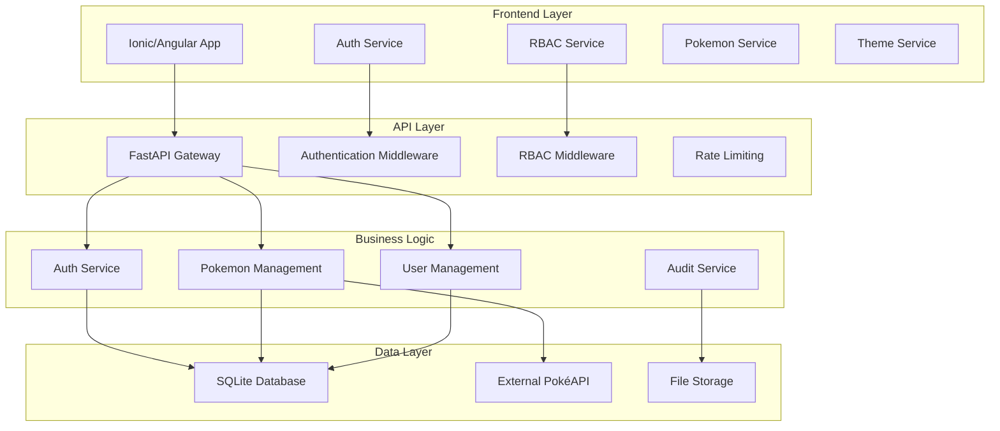
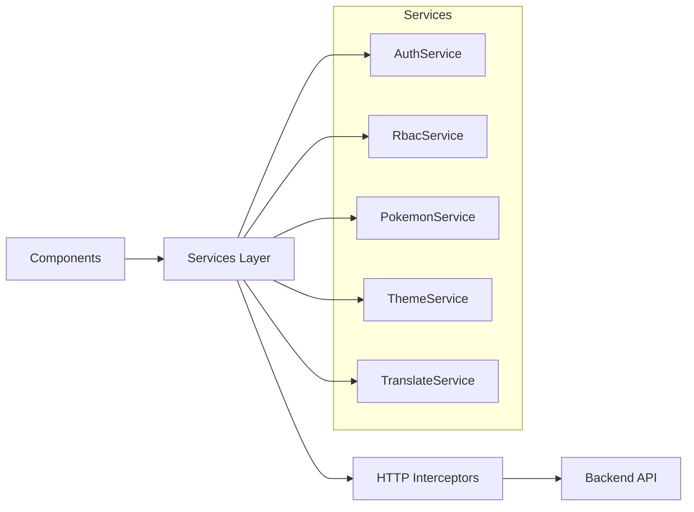
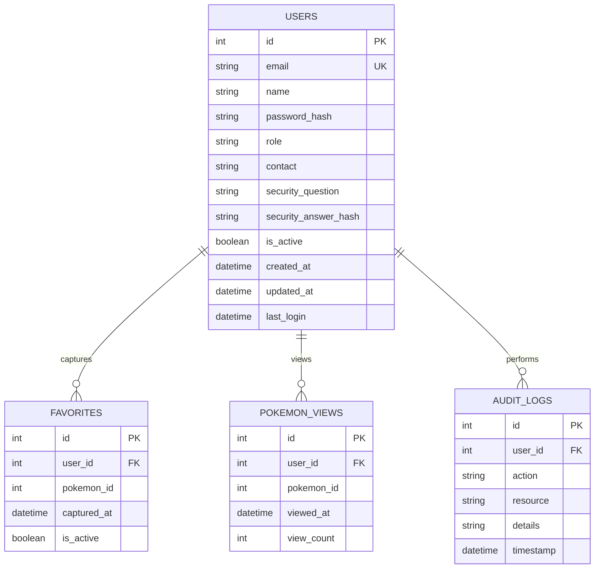
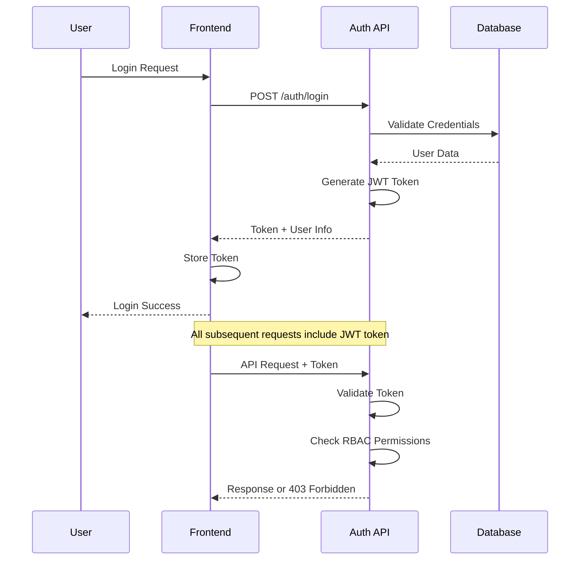
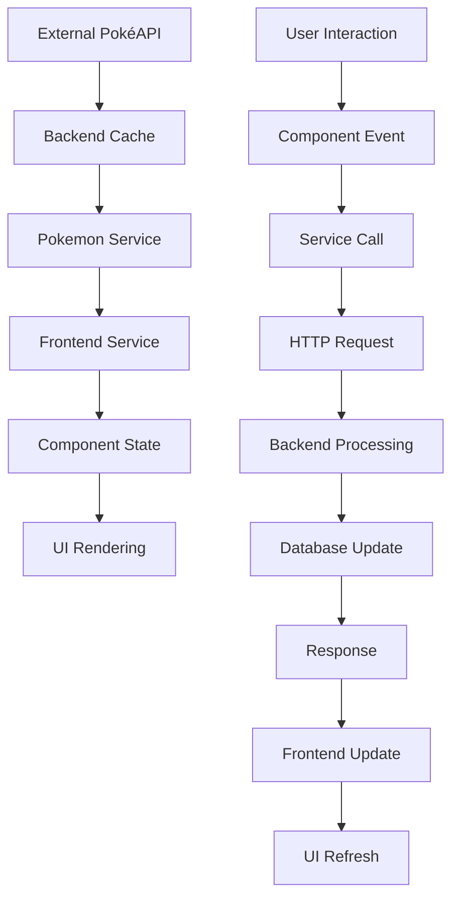
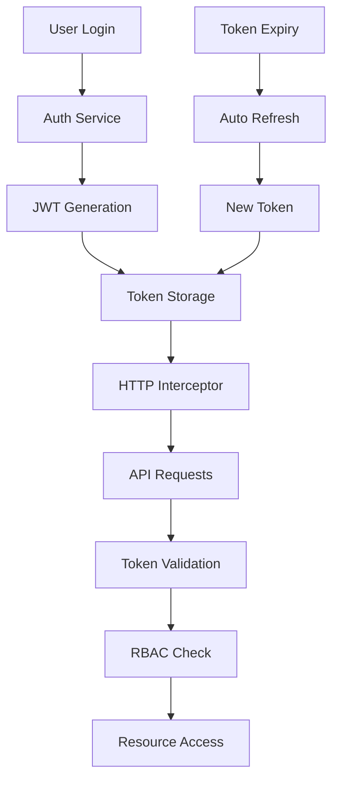
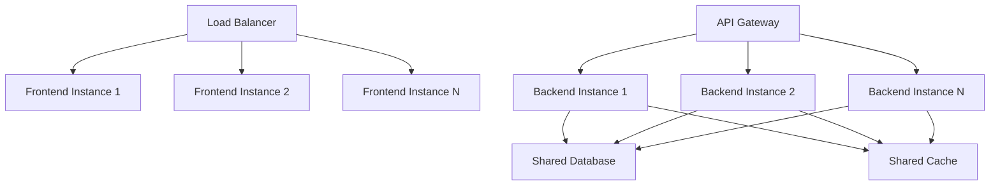

# 🏗️ PokeAPIApp - Documentação de Arquitetura

🗓️ **Última atualização**: 11/07/2025
📋 **Status**: Arquitetura completa com sistema RBAC implementado

---

## 🎯 Visão Geral

O PokeAPIApp é uma aplicação full-stack moderna construída com arquitetura inspirada em microserviços, apresentando frontend e backend desacoplados com segurança abrangente e controle de acesso baseado em roles (RBAC).

## System Architecture



## Frontend Architecture

### Component Hierarchy

```
App Component
├── Tabs Component
│   ├── Home Page
│   │   ├── Pokemon Card Component
│   │   ├── Search Component
│   │   └── Filter Component
│   ├── Captured Page
│   │   └── Pokemon Grid Component
│   ├── Ranking Page
│   │   └── Ranking List Component
│   └── Settings Page
│       └── Settings Cards Component
├── Auth Modal Component
├── Pokemon Details Modal
├── Admin Pokemon Modal
└── Sidebar Menu Component
```

### Service Architecture



### State Management

- **Local State**: Component-level state using Angular reactive forms
- **Shared State**: Services with BehaviorSubjects for cross-component communication
- **Persistent State**: LocalStorage for user preferences and authentication tokens
- **Cache**: HTTP interceptors for API response caching

## Backend Architecture

### API Structure

```
FastAPI Application
├── Core Module
│   ├── Database Configuration
│   ├── Authentication
│   ├── RBAC System
│   └── Security Middleware
├── Routes Module
│   ├── Authentication Routes
│   ├── Pokemon Routes
│   ├── User Routes
│   ├── Admin Routes
│   └── Sync Routes
├── Services Module
│   ├── Auth Service
│   ├── Pokemon Service
│   ├── User Service
│   └── External API Service
├── Models Module
│   ├── User Model
│   ├── Pokemon Model
│   └── Audit Model
└── Schemas Module
    ├── Request Schemas
    ├── Response Schemas
    └── Validation Schemas
```

### Database Schema



## Security Architecture

### Authentication Flow



### RBAC System

#### Role Hierarchy
```
Administrator (Level 2)
├── All User permissions
├── Pokemon Management
│   ├── Create Pokemon
│   ├── Edit Pokemon
│   └── Delete Pokemon
├── User Management
│   ├── View Users
│   ├── Manage Roles
│   └── Audit Logs
└── System Administration
    ├── Database Management
    └── System Statistics

User (Level 1)
├── All Visitor permissions
├── Authentication
├── Pokemon Capture
├── Collection Management
└── Profile Management

Visitor (Level 0)
├── View Pokemon List
├── View Pokemon Details
├── Use Search/Filters
└── View Public Rankings
```

#### Permission Matrix

| Permission | Visitor | User | Admin |
|------------|---------|------|-------|
| VIEW_POKEMON_LIST | ✅ | ✅ | ✅ |
| VIEW_POKEMON_DETAILS | ✅ | ✅ | ✅ |
| USE_SEARCH_FILTERS | ✅ | ✅ | ✅ |
| VIEW_RANKING | ✅ | ✅ | ✅ |
| CAPTURE_POKEMON | ❌ | ✅ | ✅ |
| MANAGE_PERSONAL_COLLECTION | ❌ | ✅ | ✅ |
| UPDATE_PROFILE | ❌ | ✅ | ✅ |
| ADD_POKEMON | ❌ | ❌ | ✅ |
| EDIT_POKEMON | ❌ | ❌ | ✅ |
| DELETE_POKEMON | ❌ | ❌ | ✅ |
| MANAGE_USERS | ❌ | ❌ | ✅ |
| ACCESS_ADMIN_DASHBOARD | ❌ | ❌ | ✅ |

## Data Flow

### Pokemon Data Flow



### Authentication Data Flow



## Performance Considerations

### Frontend Optimizations

1. **Lazy Loading**: Route-based code splitting
2. **OnPush Strategy**: Change detection optimization
3. **Virtual Scrolling**: Large list performance
4. **Image Optimization**: WebP format with fallbacks
5. **Bundle Splitting**: Vendor and app code separation
6. **Service Workers**: Offline capability and caching

### Backend Optimizations

1. **Database Indexing**: Optimized queries
2. **Response Caching**: Redis-like caching strategy
3. **Connection Pooling**: Database connection management
4. **Async Processing**: Non-blocking I/O operations
5. **Rate Limiting**: API abuse prevention
6. **Compression**: Gzip response compression

## Scalability Architecture

### Horizontal Scaling



### Microservices Evolution

Future architecture can evolve to:

```
API Gateway
├── Authentication Service
├── Pokemon Management Service
├── User Management Service
├── Notification Service
└── Analytics Service
```

## Deployment Architecture

### Development Environment
```
Developer Machine
├── Frontend (ng serve)
├── Backend (uvicorn)
└── Database (SQLite)
```

### Production Environment
```
Cloud Infrastructure
├── CDN (Frontend Assets)
├── Load Balancer
├── Application Servers
├── Database Cluster
└── Monitoring & Logging
```

## Monitoring and Observability

### Metrics Collection
- **Application Metrics**: Response times, error rates
- **Business Metrics**: User engagement, Pokemon captures
- **Infrastructure Metrics**: CPU, memory, disk usage
- **Security Metrics**: Failed login attempts, permission violations

### Logging Strategy
- **Structured Logging**: JSON format for easy parsing
- **Log Levels**: DEBUG, INFO, WARN, ERROR, CRITICAL
- **Audit Logging**: All admin operations tracked
- **Error Tracking**: Centralized error collection

### Health Checks
- **Application Health**: API endpoint availability
- **Database Health**: Connection and query performance
- **External Dependencies**: PokéAPI availability
- **Security Health**: Certificate expiry, vulnerability scans

## Technology Decisions

### Frontend Technology Choices

| Technology | Reason | Alternatives Considered |
|------------|--------|------------------------|
| **Ionic** | Cross-platform, native feel | React Native, Flutter |
| **Angular** | Enterprise-grade, TypeScript | React, Vue.js |
| **TypeScript** | Type safety, better tooling | JavaScript |
| **SCSS** | Advanced CSS features | CSS, Styled Components |
| **RxJS** | Reactive programming | Promises, async/await |

### Backend Technology Choices

| Technology | Reason | Alternatives Considered |
|------------|--------|------------------------|
| **FastAPI** | Modern, fast, auto-docs | Django, Flask, Express |
| **SQLAlchemy** | Mature ORM, flexibility | Django ORM, Prisma |
| **SQLite** | Simplicity, embedded | PostgreSQL, MySQL |
| **Pydantic** | Data validation, serialization | Marshmallow, Cerberus |
| **JWT** | Stateless, scalable | Sessions, OAuth |

## Future Architecture Considerations

### Planned Enhancements

1. **Microservices Migration**: Split monolithic backend
2. **Event-Driven Architecture**: Implement message queues
3. **CQRS Pattern**: Separate read/write operations
4. **GraphQL API**: More flexible data fetching
5. **Real-time Features**: WebSocket integration
6. **Mobile Apps**: Native iOS/Android applications

### Scalability Roadmap

1. **Phase 1**: Optimize current architecture
2. **Phase 2**: Implement caching layer
3. **Phase 3**: Database sharding/replication
4. **Phase 4**: Microservices decomposition
5. **Phase 5**: Multi-region deployment

This architecture provides a solid foundation for the current application while allowing for future growth and evolution.
