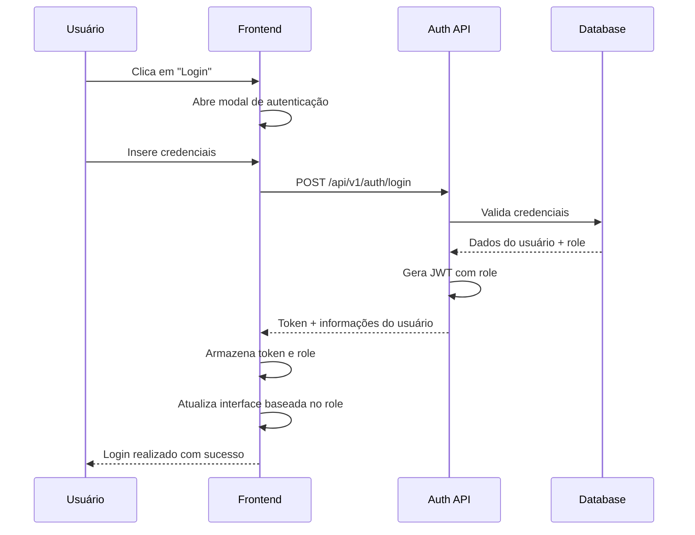
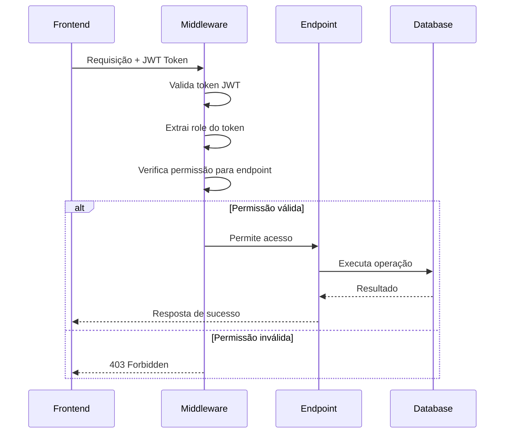

# 🔐 Sistema RBAC - PokeAPIApp

🗓️ **Última atualização**: 11/07/2025  
📋 **Status**: Sistema RBAC completamente implementado e funcional  
🎯 **Versão**: 1.0.0 - Controle de acesso baseado em roles

---

## 🎯 Visão Geral do Sistema

O PokeAPIApp implementa um sistema completo de **RBAC (Role-Based Access Control)** que controla o acesso às funcionalidades da aplicação baseado em roles de usuário. O sistema garante segurança granular e auditoria completa de todas as operações.

### 🏗️ **Arquitetura do Sistema RBAC**
- **Frontend**: Controle de interface baseado em roles
- **Backend**: Middleware de autorização para endpoints
- **Database**: Armazenamento seguro de roles e permissões
- **Auditoria**: Logs completos de operações administrativas

---

## 👥 Roles e Permissões

### **Hierarquia de Roles**

```
👑 Administrator (Nível 2)
├── Todas as permissões de User
├── Gerenciamento de Pokémon
├── Controle de usuários
└── Acesso a logs de auditoria

🎮 User (Nível 1)
├── Todas as permissões de Visitor
├── Autenticação e perfil
├── Captura de Pokémon
└── Gerenciamento de coleção

👤 Visitor (Nível 0)
├── Visualização da Pokédex
├── Uso de filtros e busca
└── Acesso ao ranking público
```

### **Permissões Detalhadas**

#### **📋 Permissões Básicas (Todos os Usuários)**
| Permissão | Descrição | Visitor | User | Admin |
|-----------|-----------|---------|------|-------|
| `VIEW_POKEMON_LIST` | Visualizar lista de Pokémon | ✅ | ✅ | ✅ |
| `VIEW_POKEMON_DETAILS` | Ver detalhes de Pokémon | ✅ | ✅ | ✅ |
| `USE_SEARCH_FILTERS` | Usar busca e filtros | ✅ | ✅ | ✅ |
| `VIEW_RANKING` | Visualizar ranking público | ✅ | ✅ | ✅ |

#### **🎮 Permissões de Usuário Autenticado**
| Permissão | Descrição | Visitor | User | Admin |
|-----------|-----------|---------|------|-------|
| `CAPTURE_POKEMON` | Capturar Pokémon | ❌ | ✅ | ✅ |
| `MANAGE_PERSONAL_COLLECTION` | Gerenciar coleção pessoal | ❌ | ✅ | ✅ |
| `UPDATE_PROFILE` | Atualizar perfil | ❌ | ✅ | ✅ |
| `VIEW_PERSONAL_STATS` | Ver estatísticas pessoais | ❌ | ✅ | ✅ |

#### **👑 Permissões Administrativas**
| Permissão | Descrição | Visitor | User | Admin |
|-----------|-----------|---------|------|-------|
| `ADD_POKEMON` | Adicionar novos Pokémon | ❌ | ❌ | ✅ |
| `EDIT_POKEMON` | Editar Pokémon existentes | ❌ | ❌ | ✅ |
| `DELETE_POKEMON` | Remover Pokémon | ❌ | ❌ | ✅ |
| `MANAGE_USERS` | Gerenciar usuários | ❌ | ❌ | ✅ |
| `ACCESS_ADMIN_DASHBOARD` | Acessar dashboard admin | ❌ | ❌ | ✅ |
| `VIEW_AUDIT_LOGS` | Visualizar logs de auditoria | ❌ | ❌ | ✅ |

---

## 🔐 Fluxos de Autenticação e Autorização

### **Fluxo de Autenticação**



### **Fluxo de Autorização**



---

## 📋 Endpoints Protegidos por Role

### **🔓 Endpoints Públicos (Sem Autenticação)**
| Endpoint | Método | Descrição |
|----------|--------|-----------|
| `/api/v1/pokemon/` | GET | Listar Pokémon |
| `/api/v1/pokemon/{id}` | GET | Detalhes do Pokémon |
| `/api/v1/ranking/` | GET | Ranking público |
| `/api/v1/auth/login` | POST | Autenticação |
| `/api/v1/auth/register` | POST | Registro de usuário |

### **🎮 Endpoints de Usuário (Role: User)**
| Endpoint | Método | Descrição | Permissão |
|----------|--------|-----------|-----------|
| `/api/v1/favorites/` | GET | Listar capturas | `MANAGE_PERSONAL_COLLECTION` |
| `/api/v1/favorites/` | POST | Capturar Pokémon | `CAPTURE_POKEMON` |
| `/api/v1/favorites/{id}` | DELETE | Liberar Pokémon | `MANAGE_PERSONAL_COLLECTION` |
| `/api/v1/auth/me` | GET | Perfil do usuário | `UPDATE_PROFILE` |

### **👑 Endpoints Administrativos (Role: Administrator)**
| Endpoint | Método | Descrição | Permissão |
|----------|--------|-----------|-----------|
| `/api/v1/admin/pokemon/` | POST | Adicionar Pokémon | `ADD_POKEMON` |
| `/api/v1/admin/pokemon/{id}` | PUT | Editar Pokémon | `EDIT_POKEMON` |
| `/api/v1/admin/pokemon/{id}` | DELETE | Remover Pokémon | `DELETE_POKEMON` |
| `/api/v1/admin/users/` | GET | Listar usuários | `MANAGE_USERS` |
| `/api/v1/admin/stats/` | GET | Estatísticas do sistema | `ACCESS_ADMIN_DASHBOARD` |
| `/api/v1/admin/audit-logs/` | GET | Logs de auditoria | `VIEW_AUDIT_LOGS` |

---

## 🛡️ Medidas de Segurança Implementadas

### **Autenticação JWT**
- 🔑 **Tokens seguros**: Assinatura HMAC SHA-256
- ⏰ **Expiração**: Tokens expiram em 1 hora
- 🔄 **Refresh**: Sistema de renovação automática
- 📱 **Stateless**: Não requer armazenamento de sessão

### **Validação de Permissões**
- 🛡️ **Middleware**: Verificação automática em cada requisição
- 📋 **Granular**: Permissões específicas por funcionalidade
- 🔍 **Auditoria**: Log de todas as tentativas de acesso
- ❌ **Negação padrão**: Acesso negado por padrão

### **Proteção de Dados**
- 🔐 **Senhas**: Hash bcrypt com salt
- 🛡️ **SQL Injection**: Queries parametrizadas
- 🚫 **XSS**: Sanitização de inputs
- 🔒 **CORS**: Origens controladas

---

## 📊 Auditoria e Logs

### **Eventos Auditados**
- 🔐 **Autenticação**: Login, logout, falhas de login
- 👑 **Operações Admin**: CRUD de Pokémon, gerenciamento de usuários
- 🎮 **Ações de Usuário**: Captura/liberação de Pokémon
- 🚫 **Tentativas de Acesso**: Acessos negados por permissão

### **Estrutura dos Logs**
```json
{
  "timestamp": "2025-07-11T20:00:00Z",
  "user_id": 1,
  "user_email": "admin@example.com",
  "action": "DELETE_POKEMON",
  "resource": "pokemon/151",
  "ip_address": "192.168.1.100",
  "user_agent": "Mozilla/5.0...",
  "success": true,
  "details": "Pokémon Mew removido do sistema"
}
```

---

## 🎮 Interface de Usuário Baseada em Roles

### **Controle de Visibilidade**
- 👤 **Visitor**: Apenas visualização e navegação
- 🎮 **User**: + Botões de captura e gerenciamento de coleção
- 👑 **Admin**: + Interface administrativa completa

### **Componentes Condicionais**
```typescript
// Exemplo de controle no frontend
<ion-button *ngIf="rbacService.hasPermission('CAPTURE_POKEMON')" 
            (click)="capturePokemon()">
  Capturar
</ion-button>

<ion-button *ngIf="rbacService.hasRole('Administrator')" 
            (click)="openAdminPanel()">
  Painel Admin
</ion-button>
```

---

## 🔧 Configuração e Administração

### **👑 Credenciais de Administrador Padrão**
- **Email**: admin@example.com
- **Senha**: admin
- **Role**: Administrator
- **Criado**: Automaticamente na inicialização

### **Gerenciamento de Usuários**
- ➕ **Criar usuários**: Via interface administrativa
- ✏️ **Editar roles**: Alterar permissões de usuários
- 🚫 **Desativar usuários**: Suspender acesso sem deletar
- 📊 **Monitorar atividade**: Logs de ações por usuário

### **Configurações de Segurança**
- ⏰ **Tempo de expiração**: Configurável (padrão: 1 hora)
- 🔄 **Política de senhas**: Mínimo 6 caracteres
- 🚫 **Tentativas de login**: Limite de tentativas (futuro)
- 📱 **Sessões múltiplas**: Permitidas por padrão

---

## 🚀 Próximas Evoluções

### **Funcionalidades Planejadas**
- 🔐 **2FA**: Autenticação de dois fatores
- 📱 **OAuth**: Login social (Google, GitHub)
- 🕐 **Sessões**: Controle de sessões ativas
- 🚫 **Rate Limiting**: Proteção contra ataques
- 📊 **Dashboard**: Métricas de segurança em tempo real

### **Melhorias de UX**
- 🔄 **Auto-refresh**: Renovação automática de tokens
- 📱 **Remember me**: Sessões persistentes opcionais
- 🎯 **Onboarding**: Tutorial para novos administradores
- 📊 **Feedback**: Indicadores visuais de permissões

---

*🔐 Sistema RBAC implementado e documentado pela equipe de desenvolvimento*  
*🔄 Data: 11/07/2025 - Versão 1.0.0*  
*✅ Status: Sistema completo e funcional em produção*
