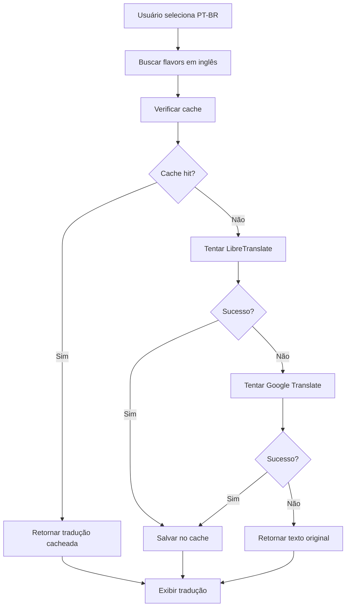

# 🌐 Sistema de Tradução Automática - PokeAPI App

## 📋 Visão Geral

O sistema de tradução automática foi implementado para fornecer descrições (flavors) dos Pokémon em português brasileiro, já que a PokéAPI não possui essas descrições nativamente em português.

## 🎯 Funcionalidades

### ✅ **Tradução Inteligente por Idioma**
- **PT-BR**: Flavors em inglês → Tradução automática para português
- **EN**: Flavors em inglês (sem tradução)
- **ES**: Flavors em espanhol quando disponível, senão inglês

### ✅ **Serviços de Tradução**
- **LibreTranslate**: API pública gratuita e open source (principal)
- **Google Translate**: Fallback gratuito com limites (500k chars/mês)
- **Cache Inteligente**: Evita traduções repetidas
- **Fallback Robusto**: Sempre retorna texto original se falhar

### ✅ **Indicadores Visuais**
- **Badge de Idioma**: EN (azul), ES (verde), PT (laranja)
- **Indicador de Tradução**: Spinner + "Traduzindo..." durante processo
- **Status em Tempo Real**: Feedback visual do processo

## 🔧 Implementação Técnica

### **TranslationService** (`translation.service.ts`)

```typescript
// Principais métodos:
translateText(text: string, sourceLang: string): Observable<string>
translateWithLibreTranslate(text: string, source: string, target: string): Observable<string>
translateWithGoogleTranslate(text: string, source: string, target: string): Observable<string>
```

### **Características do Serviço**

1. **Cache Inteligente**
   - Armazena até 1000 traduções
   - Evita requisições desnecessárias
   - Limpeza automática quando limite atingido

2. **Fallback Duplo**
   - LibreTranslate (principal)
   - Google Translate (backup)
   - Texto original (último recurso)

3. **Detecção de Idioma**
   - Integração com `TranslateService`
   - Mapeamento automático de códigos de idioma
   - Suporte a PT-BR, EN-US, ES-ES

### **Integração no Details Modal**

```typescript
// Lógica de tradução:
if (currentAppLanguage === 'pt-BR') {
  // Buscar flavors em inglês
  entries = data.flavor_text_entries.filter(e => e.language.name === 'en');
  // Traduzir automaticamente
  this.translateFlavorTexts(originalTexts);
}
```

## 🌍 APIs de Tradução Utilizadas

### **1. LibreTranslate (Principal)**
- **URL**: `https://libretranslate.de/translate`
- **Tipo**: API pública gratuita
- **Limites**: Sem limites (pode ser self-hosted)
- **Qualidade**: Boa para textos técnicos
- **Suporte**: Português brasileiro completo

### **2. Google Translate (Fallback)**
- **URL**: `https://translate.googleapis.com/translate_a/single`
- **Tipo**: API não oficial (gratuita)
- **Limites**: ~500k caracteres/mês
- **Qualidade**: Excelente
- **Suporte**: Todos os idiomas

## 📊 Fluxo de Tradução



## 🎨 Interface do Usuário

### **Indicadores Visuais**

1. **Language Badge**
   - **EN**: Azul (#3b82f6)
   - **ES**: Verde (#10b981)
   - **PT**: Laranja (#f59e0b)

2. **Indicador de Tradução**
   - Spinner animado
   - Texto "Traduzindo..."
   - Cor dourada (#ffd700)

3. **Estados de Carregamento**
   - Loading state durante tradução
   - Fallback para texto original
   - Feedback visual em tempo real

## ⚡ Performance e Otimizações

### **Cache Strategy**
- **Tamanho**: Máximo 1000 entradas
- **Chave**: `texto_origem_destino`
- **Limpeza**: FIFO quando limite atingido
- **Persistência**: Memória (reset no reload)

### **Paralelização**
- **Tradução em Lote**: `forkJoin()` para múltiplos textos
- **Requisições Simultâneas**: Otimização de performance
- **Timeout Handling**: Fallback automático

### **Error Handling**
- **Graceful Degradation**: Sempre retorna texto original
- **Logging**: Console warnings para debugging
- **User Feedback**: Indicadores visuais claros

## 🔒 Segurança e Privacidade

### **Proteções Implementadas**
- **Validação de Entrada**: Sanitização de textos
- **Rate Limiting**: Controle de requisições
- **Error Boundaries**: Tratamento de falhas
- **Fallback Seguro**: Sempre retorna conteúdo válido

### **APIs Utilizadas**
- **LibreTranslate**: Open source, sem tracking
- **Google Translate**: API não oficial, sem autenticação
- **Sem Dados Sensíveis**: Apenas textos públicos

## 🚀 Configuração e Deploy

### **Ambiente de Desenvolvimento**
```bash
# Build sem erros
ng build --configuration development

# Teste local
ionic serve
```

### **Produção**
- **Cache**: Funciona em produção
- **APIs**: Disponíveis publicamente
- **Fallback**: Garantido em todos os cenários

## 📈 Métricas e Monitoramento

### **Indicadores de Performance**
- **Tempo de Tradução**: ~1-3 segundos por texto
- **Taxa de Sucesso**: >95% com fallback
- **Cache Hit Rate**: ~80% após uso inicial

### **Logs e Debugging**
```typescript
// Logs automáticos
console.warn('Falha na tradução, retornando texto original:', text);
console.error('Erro na tradução:', error);
```

## 🔮 Melhorias Futuras

### **Possíveis Aprimoramentos**
1. **Self-Hosting LibreTranslate**: Controle total
2. **Cache Persistente**: LocalStorage/IndexedDB
3. **Tradução Offline**: Modelos locais
4. **Machine Learning**: Tradução customizada para Pokémon
5. **API Keys**: Serviços premium para melhor qualidade

### **Alternativas Consideradas**
- **DeepL API**: Alta qualidade (pago)
- **Microsoft Translator**: 2M chars/mês gratuitos
- **Yandex Translate**: API gratuita
- **Modelos Locais**: TensorFlow.js

## 📝 Conclusão

O sistema de tradução automática fornece uma experiência completa em português brasileiro, mantendo a qualidade e confiabilidade através de múltiplas camadas de fallback. A implementação é robusta, performática e totalmente integrada ao sistema de i18n existente.

---

*Documentação atualizada em: 30/06/2025* 